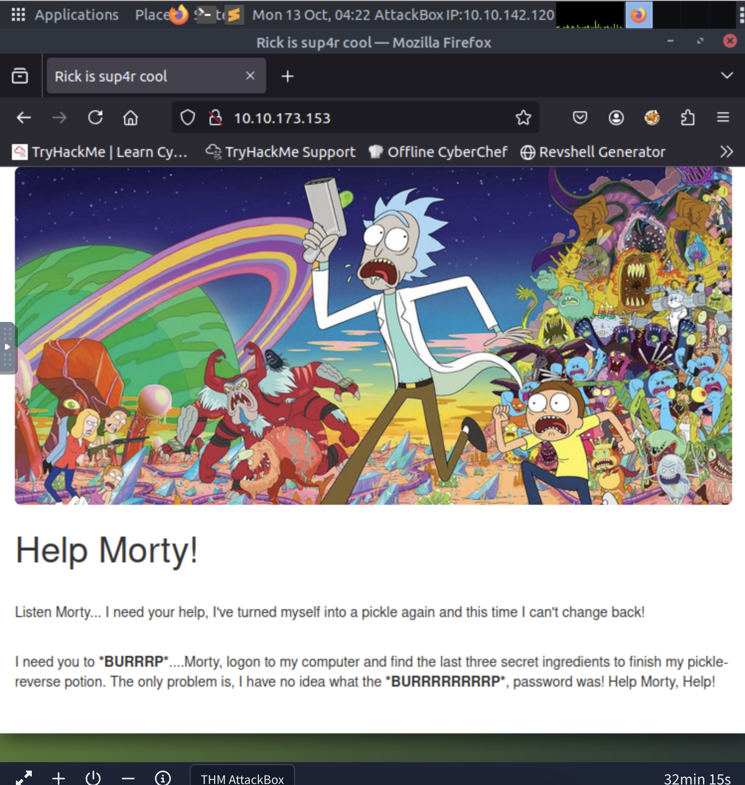

# Pickle Rick Write Up (TryHackMe Beginner CTF)

Link: https://tryhackme.com/room/picklerick?ref=blog.tryhackme.com 

This isn't a very comprehensive write-up since I'm writing this as I go to keep track of my steps. 

The target IP I was given was 10.10.173.153. Since this is my first CTF, I wasn't sure what to do so I googled "What to do with a target IP in a CTF?"

The first thing I did was put the following into the terminal. This checks the connection. The connection was there, so this didn't do anything. 
    
    ping [target IP] 

Then I tried 
    
    nmap -A [target IP]

So, I got the http title "Rick is sup4r cool." But there didn't see anything else that seemed relevant beyond that. 

There are other flags that can be tried with nmap. -sV is one of them, so I added that flag. That didn't do anything (though I might have done it wrong) so I also added the -sC flag, as suggested by another website. -sV detects service versions running on open ports and -sC runs some general scripts. 

These ports were shown: 

PORT   STATE SERVICE VERSION

22/tcp open  ssh     OpenSSH 8.2p1 Ubuntu 4ubuntu0.11 (Ubuntu Linux; protocol 2.0)

80/tcp open  http    Apache httpd 2.4.41 ((Ubuntu))

This tells me that I can open the browser and go to the URL http://10.10.173.153. Presumably, I can also do something with ssh, but I'll come back to that later if this doesn't work. 

This URL took me to a website that looked promising. 

I clicked inspect element because that's a standard first-thing-to-do. It showed me a comment saying that the username was: R1ckRul3s

That's probably important. 

The next standard step is to check for a robots.txt file. A robots.txt file is used to tell search engines which page not to crawl. Something worth noting though is that there are different tools for finding hidden directories such as Gobuster, Dirbuster, and Dirb. I can explore these later if I need to. 

This was in robots.txt:
Wubbalubbadubdub 

It's probably the password. 

Now, I need to figure out what to even do with this username and probably-password. 

Trying one of the tools I listed before might be a good idea to find other directories. I'm going to try Gobuster first. 

I ran the following in the virtual box: 

    sudo apt install gobuster 

This is the command I ran after installing Gobuster:

    gobuster dir -u http://10.10.173.153 -w /usr/share/wordlists/dirb/common.txt

And this was the result: 

/.hta                 (Status: 403) [Size: 278]

/.htpasswd            (Status: 403) [Size: 278]

/assets               (Status: 301) [Size: 315] [--> http://10.10.173.153/assets/]

/.htaccess            (Status: 403) [Size: 278]

/index.html           (Status: 200) [Size: 1062]

/robots.txt           (Status: 200) [Size: 17]

/server-status        (Status: 403) [Size: 278]

Now, I can try looking through these pages to see if one of them has a login. 

- /.hta --> Forbidden
- /.htpasswd --> Forbidden
- /assets --> Seems to be the images for the site. Might be useful later. 
- /.htaccess --> Forbidden
- /index.html --> The main page 
- /robots.txt --> Already visited this
- /server-status --> Forbidden

Going back to the images...

I got stumped here and asked ChatGPT. But it didn't really give me anything useful. All the stuff it was telling me to do seemed to complicated for a beginner CTF. 

I'm going to try to use another searching tool, dirb.

This didn't give me any other directories either. 

I kind of just cheated at this point and went to portal.php because that's what the internet said to do next for this CTF. 

Well, I have to stop here. It's been an hour and apparently, that's TryHackMe's daily limit for free users. While I didn't get to finish this CTF, I learned about gobuster, inspect element, robot.txt, and how to get a CTF started. 

